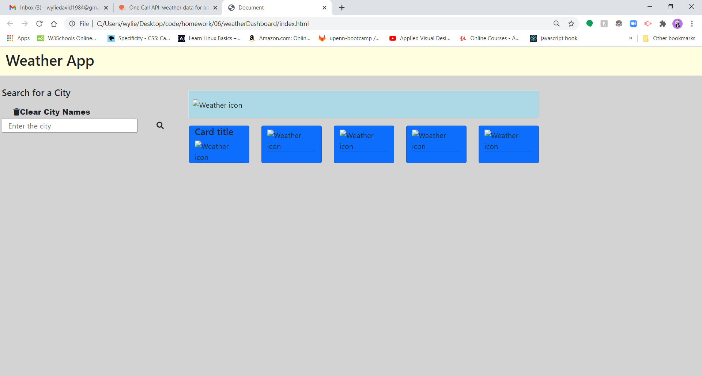
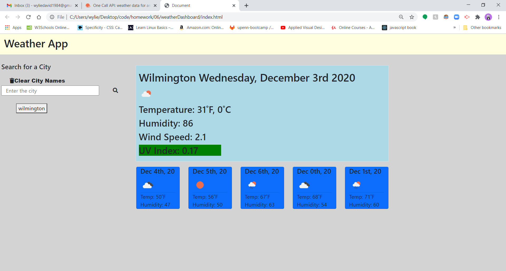
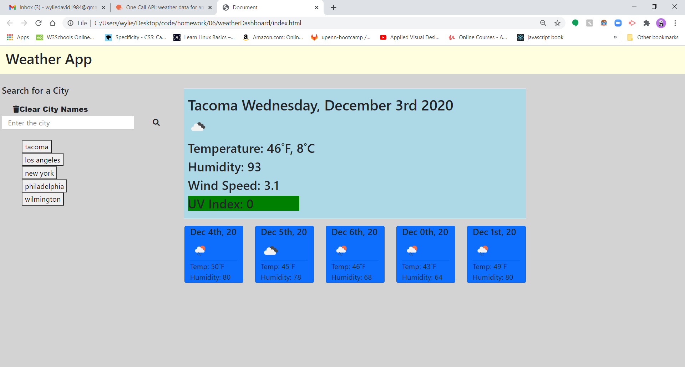
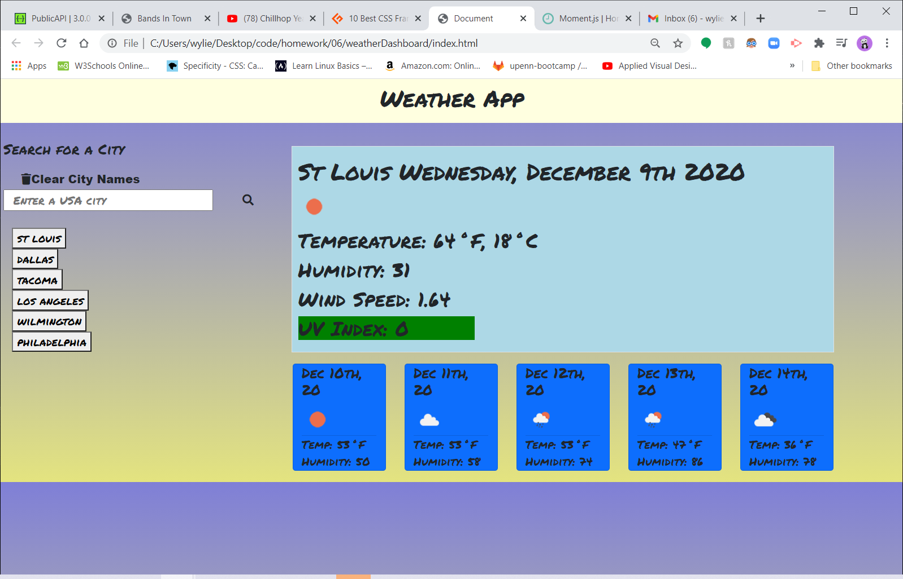

# WeatherDashboard

## Description

Our assignment was to create a weather application.  If the user puts in a city in the US, it will give both the daily forecast as well as the five day. The daily has the name and the date listed along the side of the city. The next part of daily forecast is an icon displaying what the weather will be like.  The temp is displayed in both fahrenheit and celsius. Daily then displays what the humidity level will be that day.  Wind speed is next in the display.  Then the last item displayed is UV index that will display both the index as a value and a color to show where on the index that lies.  Green, yellow, orange, red, and purple are the different levels that will be displayed from lowest to highest.  Then the five day shows us the date, an icon, temp and humidity.  The search bar will create buttons to go back to previous links if the user decides to revisit a previously searched city.  Upon reload, it will use the very last city searched/the city at the top of the button list as the current.  If the user wants to clear out the city buttons there is also a clear button. 

## Table of Contents

-[Javascript](#Javascript)
   
-[Usage](##Usage)

-[Credits](##Credits)

## Links

*[Git Repository](https://github.com/wyliedavid1984/weatherDashboard)

*[Deployed link](https://wyliedavid1984.github.io/weatherDashboard/)

## Javascript

 Javascript

### Global Variables

I only used two global variables in application.  The first is previous cities which pulls all the old data that was used from local storage.  After that I set some conditionals which will check if there is anything in local storage.  If there isn't any, set to an empty array. If there is then it'll create buttons for each index in the array. I also use this to store any new data entered from the search bar.

The next variable city name is used to put the users last searched city on the app.  It will then be called upon in the weather balloon function to display that city's information.

### Buttons

All the buttons are listed as they fall in the javascript file.

#### Clear Button

This button was created so that the user can delete the city buttons and start over. It works with jquery.  I select the button through a class name, then on the button I use the on method that is listening for a click. That will fire off the anonymous function.  The function itself is very simple.  We clear any default actions and then just clear local store with the clear method.

#### Search Button

This button was made for the user to input a city and then get back weather information for that city.  With jquery I selected the class of the button, and then added the on method listening for a click event to run a function.  I used event.preventDefault() to keep the form from refreshing the page. Then I declared a variable that stores the input value, which is this button's sibling. I used a conditional to check whether or not the user entered in a value.  I also check if the user has previously entered that value. If neither of the conditions are met, the user's data will be pushed into the previous city's array and a button is created with a class of city and a value of the user's city. From this point we then set that city into local storage. Followed by resetting the search bar to a blank value so that the place holder is showing. The last thing the button will do is call the weather balloon function and passes the user city as a parameter.

#### City Button

This button was created so that the user could just click on the city list and the weather data would reappear. Again using jquery select class and then listen for click with on method and call anonymous function.  In the function to prevent any action preventDefault is used. I then take a variable to set it equal to the text of the button, and pass that value into the weatherBalloon function. Upon clicking the button, the weather data will show on the screen.

### Functions

#### Timed Background

I made this function to create a little bit of a dynamic background that matches the time of the day.  In the function I make use of a variable to take in the hour of the day.  The function will set a conditional that changes the color scheme for the time of day. 

#### Weather Balloon

This function makes a couple of ajax calls to retrieve data and then posts that data to the screen. I start by making two local variables, one into my api key, and then the other is an URL that has the city passed to the function, as well as the key variable used to create the URL.  

After that I make a ajax request to get the data from that api.  I only needed the latitude and longitude from the specific call.  So I saved them to the corresponding variable and then stringify that data.  From there I created another URL that takes in the lat and lon and make a second ajax request. 

In the second request I append or add most of my content to the DOM.  I start off by making several local variables that get an icon url and then two to calculate Kelvin into both Celsius and Fahrenheit. In the variables I start to maneuver through the api object that was used to get specific data. The next several lines of code is where I start to add some content to the jumbotron on the page.  Using jquery I add city, date,
temp, humidity, wind speed and an icon.  After that I use a conditional to color code the UV index, and then set the UV index to the dom. 

The last part of the function is where I add content to the five cards at the bottom of the screen, for the five day forecast. I make use of a for loop to make all the content.  Once again I create another URL for the icons and set it equal to the icon variable. After that I grab the img tag and set the source. The next two local variables are used to create a date and then to calculate the temp in F. After the declaration I add the following content with jquery: date, icon, temp, and humidity.

## HTML

The HTML was built with bootstrap to help with styling as well as responsiveness. I used the header tag with a nav tag to do the title on the page.  In that header I add a little bit of margin adjustment and made it a fluid container so it took up the full width.  In the nav tag I centered the content. After that I used a div to create the area where both the buttons and input line are located.  I had it set to the left side of the page and it was all wrapped in a row. Then I created the clear button, form (where the input and search button were nested), and the last part where all the city buttons were appended. I used a jumbotron to display the current day's weather.  I followed it with five cards to set the future five day forecast. 

## Usage 

The user puts in a city name within the USA, and then it will put out the weather forecast for that city.  The user can also click on the city button to check previous locations that have been entered into the search bar. If the user wants to clear out all of the buttons, they just have to click on the clear button. 

### CSS

I used css to add a little color to the app.  I added different colors to the header, jumbotron, and cards. I created several classes for both the UV index as well as for the body color scheme. The UV index will change depending on how high it is.  The body will change color depending on what time of day it is. 

### Screen Shots

Screen Shots of application

This is what the site looks like upon load.

After the first city is entered

This is with multiple cities

## Credits

* [Stack Overflow general research](https://stackoverflow.com/) 
* [W3schools general research](https://www.w3schools.com/default.asp)
* [Mdn web docs general research](https://developer.mozilla.org/en-US/)
* [Bootstrap general research](https://getbootstrap.com/)
* [AskBCS]
* [Moment.js for time](https://momentjs.com/)
* [JQuery documentation](https://api.jquery.com/)
* [Open Weather api](https://openweathermap.org/api)
* [Google Fonts](https://fonts.google.com/)
* [Font Awesome](https://fontawesome.com/v4.7.0/)